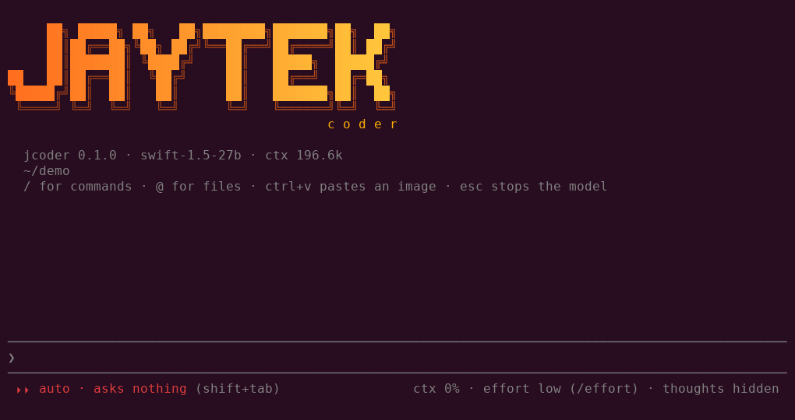
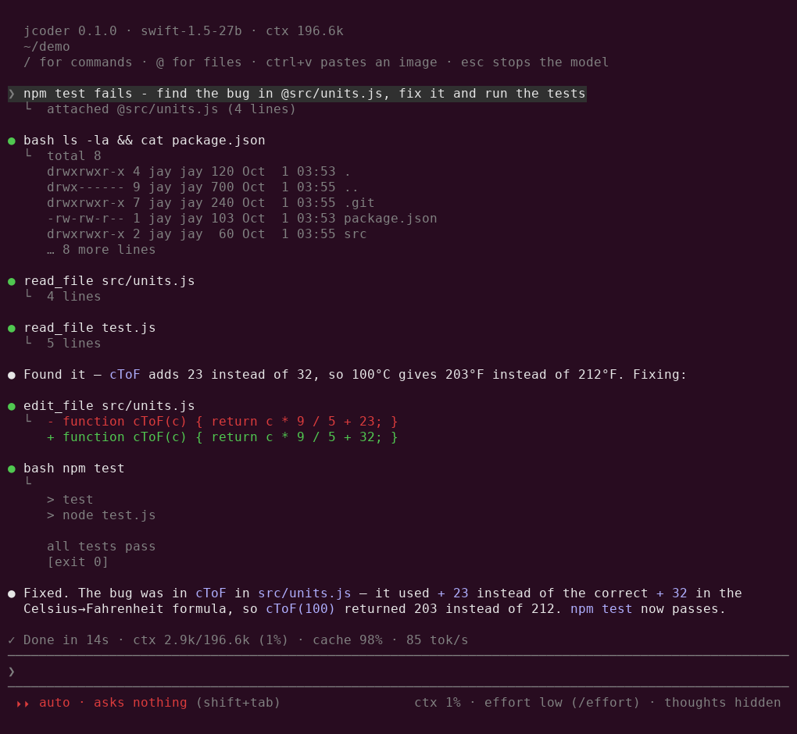

<p align="center">
  
</p>

<h1 align="center">jcoder</h1>

<p align="center">
  A coding agent for your own GPU.<br>
  Built for local models on llama.cpp: small prompt, a cache that survives,
  and a terminal that stays out of the way.
</p>

<p align="center">
  <a href="#install">Install</a> ·
  <a href="#using-it">Using it</a> ·
  <a href="#tools">Tools</a> ·
  <a href="#settings">Settings</a> ·
  <a href="#licence">Licence</a>
</p>

---

jcoder reads your code, edits it, runs your builds and tests, searches the
web, and tells you what it did, all through a model running on your own
machine. It talks to any OpenAI-compatible server and is tuned for
[llama.cpp](https://github.com/ggml-org/llama.cpp).

<p align="center">
  
</p>

## Why another one

Coding agents are usually written for big hosted models, and on a local
model they waste what you have. jcoder is built the other way round:

- **A small prompt.** The system prompt and every tool together are about
  2k tokens, around 1% of a 196k context. Some agents spend 10% before you've
  typed anything.
- **A cache that survives.** The conversation is only ever added to, never
  rewritten, so llama.cpp reuses its cache. You'll see `cache 97%` in the
  status line, and long sessions stay fast.
- **No old thinking in the context.** The model's reasoning is shown if you
  want it, but never sent back.
- **Effort you can set.** Cap how long the model thinks, per reply, so a
  local model can't think in circles.
- **Nothing cut short.** No artificial cap on replies; long tool output is
  trimmed to its start and end, and the rest is saved to a file the model
  can read.

## Install

```sh
curl -fsSL https://raw.githubusercontent.com/jaytektas/jcoder/master/install.sh | sh
```

That's all. It installs jcoder for you alone (no root) in
`~/.local/share/jcoder`, with the `jcoder` command in `~/.local/bin`. If
Node.js 22 or later isn't there, it offers to download one just for jcoder.
Run it again to reinstall; `rm -rf ~/.local/share/jcoder ~/.local/bin/jcoder`
removes it.

Then, in the project you want to work on:

```sh
jcoder
```

The first time, jcoder looks for a model server on the usual ports
(llama.cpp 8080, LM Studio 1234, Ollama 11434, vLLM 8000), offers what it
finds, or asks for an address, on this machine or another. `jcoder --setup`
changes it later. If you don't have a server yet, llama.cpp is one command:

```sh
llama-server -m your-model.gguf -ngl 99 -fa on -c 65536 --port 8080
```

Already have Node.js 22+? `npm install -g
https://github.com/jaytektas/jcoder/releases/latest/download/jcoder.tgz`
works too.

**Updates.** When a new release is out, jcoder offers it at start-up (at most
once a day): install now, not now, skip that version, or stop checking.
`/update` checks any time.

## Using it

The input stays on the bottom line; everything above it is ordinary
terminal scrollback, so your mouse wheel and Shift+PgUp work as usual.

| | |
|---|---|
| `/` | commands, filtered as you type |
| `@path` | attach a file: its text, an image, or a folder listing |
| drag and drop | drop files on the terminal to attach them, like `@path` |
| Ctrl+V | paste an image from the clipboard (screenshots welcome; the model can see) |
| Esc | stop the model |
| Shift+Tab | cycle the mode: edit → auto → read-only |
| Ctrl+T | show or hide the model's thinking |
| `\` + Enter | new line (Alt+Enter and Ctrl+J too) |
| ↑ | take back queued messages to edit them, otherwise history |
| Ctrl+C twice, Ctrl+D | quit |

Type while the model is working and your message is queued; it's sent when
the model finishes.

**Modes.** `edit` (the default) changes files freely and asks before running
commands. `auto` asks nothing (also `/yolo`, or `jcoder --yolo`). `ro` reads
only. When jcoder asks, you can say no and type what to do instead; the
model gets your reason.

**Commands**

| | |
|---|---|
| `/effort [off\|low\|medium\|high\|max]` | how hard the model thinks |
| `/mode [ro\|edit\|auto]`, `/yolo` | permissions |
| `/thoughts` | show or hide thinking |
| `/compact` | summarise the conversation to free context (automatic at 85%) |
| `/clear` | start a new conversation |
| `/resume` | pick an earlier conversation in this folder |
| `/model [id]` | list the server's models, or switch |
| `/ctx` | context used |
| `/prompt [edit]` | show the system prompt; `edit` makes a copy to change |
| `/log` | where this conversation's full log is |
| `/update` | check for a new release now |
| `/help` | everything above |

From a script: `jcoder -p "fix the failing test"` runs one request and exits.
`jcoder -c` carries on the last conversation in this folder.

## Tools

| tool | |
|---|---|
| `read_file` `write_file` `edit_file` | files; `read_file` shows images to the model too |
| `bash` | commands; `background: true` starts a server or watcher and returns at once |
| `bash_output` `bash_stop` | read a background job's new output, or stop it |
| `grep` `glob` | search contents, find files |
| `web_search` `web_fetch` | search the web through [SearXNG](https://github.com/searxng/searxng) (once `searchUrl` is set), read a page |
| `todo` | the model's checklist for a bigger job, shown above the input |
| `ask_user` | the model asks you a question, with choices, mid-task |
| `ask_model` | a second opinion from a stronger remote model (only once you set a key) |
| `agent` | hand a self-contained job to a sub-agent with a fresh context |

**Agents.** For a big search or an independent piece of work, the model can
start a sub-agent. It has the same tools (it can't start agents itself, ask
you questions or touch the to-do list), works in a fresh context, and hands
back a report; only the report enters your conversation, so it stays small.
Several agents in one reply run at the same time, up to the server's slots.
Each shows a live line above the input, and its permission questions come
to you with its name. Its prompt is `prompts/agent.md`, overridable like
the main one.

Agents run in parallel only if the server does. With llama.cpp, give it
slots that share one KV cache, so any slot can use the whole context:

```sh
llama-server -m your-model.gguf -ngl 99 -fa on -c 163840 -np 5 --kv-unified --port 8080
```

**Asking Gemini.** Put a free key from https://aistudio.google.com/apikey
in the settings (or `GEMINI_API_KEY`) and the model can ask Gemini when it's
stuck. Gemini sees only the question the model writes, never your project.
Any OpenAI-compatible API works the same way.

## Effort

| effort | thinking per reply |
|---|---|
| `off` | none |
| `low` | up to 512 tokens |
| `medium` | up to 2,048 |
| `high` (default) | up to 8,192 |
| `max` | no limit |

On llama.cpp this is a hard cap (`reasoning_budget_tokens`): when it runs
out, the model is told to answer. It works with models whose thinking
llama.cpp recognises, such as Qwen3 and DeepSeek-R1 styles. Other servers
get `reasoning_effort` instead, which is a hint rather than a limit.

## Settings

`~/.jcoder/config.json` (or `$JCODER_CONFIG`). It's written with every
setting and its default on first run, so everything you can change is in it.

| key | default | |
|---|---|---|
| `baseUrl` | `http://127.0.0.1:8080` | server root, without `/v1`; `jcoder --setup` finds it |
| `model` | first listed | model id |
| `apiKey` | | bearer token, if the server wants one |
| `contextWindow` | 32768 | used when the server doesn't report it (llama.cpp does) |
| `effort` | `high` | see [Effort](#effort) |
| `showThinking` | false | show the model's thinking |
| `mode` | `edit` | `ro` · `edit` · `auto` |
| `maxToolChars` | 24000 | tool output longer than this is cut to its start and end |
| `bashTimeout` | 120 | seconds a command may run unless the model asks for longer (max 600) |
| `searchUrl` | | a SearXNG server, e.g. `http://127.0.0.1:8888`; `web_search` is offered once it's set |
| `askModel` | Gemini, no key | the remote model for `ask_model`: `name`, `baseUrl`, `apiKey`, `model` |
| `checkUpdates` | true | offer new releases once a day |
| `compactAt` | 0.85 | share of the context that triggers compaction |
| `extraBody` | `{}` | merged into every request, e.g. sampling parameters |

**Project notes.** `~/.jcoder/JCODER.md` and a project's `JCODER.md` (or
`AGENTS.md`) are added to the system prompt. Keep them short: they go with
every request.

**The system prompt** is a template, `prompts/system.md`. `/prompt edit`
copies it to `~/.jcoder/system.md`, where your version replaces it.
Placeholders: `{{cwd}}`, `{{git}}`, `{{os}}`, `{{date}}`, `{{notes}}`.

**Sessions and logs.** Every conversation is saved in `~/.jcoder/sessions/`,
ready for `jcoder -c` or `/resume`. Next to each one, a `.log.jsonl` keeps
the full record, only ever added to: every message with the model's
thinking, every tool call and result, and what each compaction replaced.

## Building from source

```sh
git clone https://github.com/jaytektas/jcoder
cd jcoder
npm install
npm run build
ln -s "$PWD/dist/index.js" ~/.local/bin/jcoder
```

A git checkout doesn't update itself; `git pull && npm run build` does.

Releases: `scripts/release.sh patch|minor|major` bumps the version, tags it,
and publishes a GitHub release with the built package attached.

## Licence

Copyright (C) 2026 Jason Roughley

jcoder is free software: you can redistribute it and/or modify it under the
terms of the GNU General Public License as published by the Free Software
Foundation, either version 3 of the License, or (at your option) any later
version. It is distributed in the hope that it will be useful, but WITHOUT
ANY WARRANTY; without even the implied warranty of MERCHANTABILITY or
FITNESS FOR A PARTICULAR PURPOSE. See [LICENSE](LICENSE).
